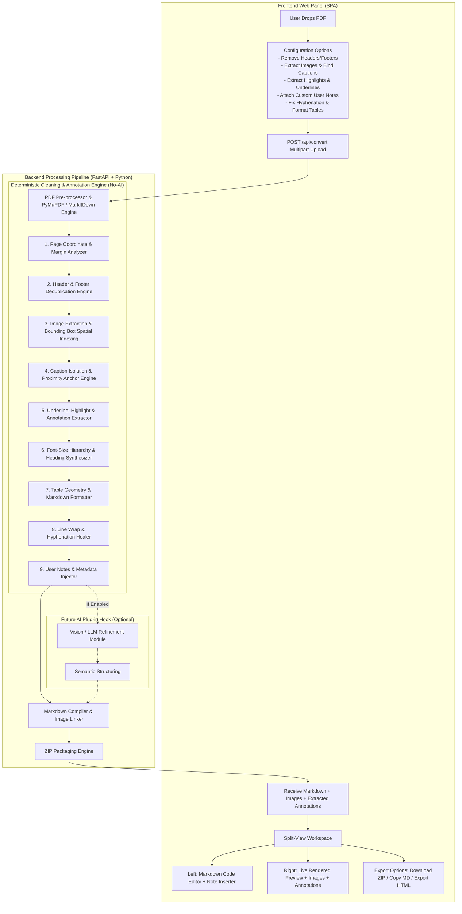

# PDF to Clean Markdown & Image Extractor Web Panel
## Complete Technical Architecture, Non-AI Layout Heuristics, and Implementation Roadmap

---

## 0. Implementation Status — 31 August 2026

### Completed: MarkItDown Dashboard Integration

The original product goal is complete: users can upload a PDF from the Personal Finance dashboard, have it processed asynchronously by an isolated FastAPI worker, edit and preview the resulting Markdown, and export the finished document.

- [x] Rails dashboard integration, authenticated owner-scoped document history, upload, delete, and source-PDF storage.
- [x] Isolated `pdf-worker` service using Microsoft MarkItDown and PyMuPDF, reachable only by the application service network.
- [x] Input safeguards: PDF signature check, 25 MB file limit, and 250-page conversion limit.
- [x] Deterministic extraction and cleanup: two-column reading order, repeated header/footer removal, hyphen and line-wrap repair, headings, validated GFM tables, images, captions, annotations, and standalone chart/diagram assets with chart-region exclusion from table/text parsing.
- [x] Configurable conversion settings: image extraction/size threshold, header/footer cleanup, caption binding, annotations, YAML frontmatter, hyphen repair, and table detection.
- [x] Workspace UI: editable Markdown, live safe preview, line numbers, find/replace, copy, image insertion, reprocessing, processing-state refresh, and extraction statistics.
- [x] Export: ZIP with relative `images/` links and standalone sanitized HTML with embedded images.
- [x] Reliable background processing using Solid Queue and a dedicated `jobs` Compose service.
- [x] Source-PDF browser preview and owner-scoped image delivery.
- [x] Automated checks: Rails suite (94 tests / 437 assertions) and worker suite (10 tests) pass; the supplied `tunablegraphene.pdf` was processed successfully.

### Deferred: Explicitly Outside the Current Goal

These are valid future additions, but they are not required for the MarkItDown-to-dashboard feature and must not block release of this phase.

- [ ] PDF editing: annotation authoring, split/merge, page reordering, and in-browser editing.
- [ ] Local OCR for scanned/image-only PDFs.
- [ ] AI/Vision refinement and AI-based receipt or invoice categorization.
- [ ] Separate notes, reminders, notification, and developer-tools modules.

---

## 1. Executive Summary & Problem Formulation

### 1.1 Objective
Build a modern, high-performance web dashboard that converts complex PDF documents into clean, structured Markdown (`.md`), automatically extracts all embedded figures/images into a companion `images/` directory, extracts user-highlighted and underlined annotations with their attached comments, allows adding custom document notes/metadata, links those images seamlessly within the generated Markdown, and exports the bundle as a downloadable ZIP archive.

### 1.2 The Core Problem & Enhanced Extraction Capabilities
Standard PDF parsers (including out-of-the-box Microsoft `markitdown`, `pdfminer`, and `pypdf`) read PDF content streams sequentially without layout-coordinate awareness or annotation parsing. This results in:
1. **Header & Footer Pollution:** Running headers, page titles, and page numbers repeatedly interrupt the middle of sentences across page boundaries.
2. **Caption & Floating Text Collision:** Figure captions (e.g., *"Figure 1: Architecture diagram"*), chart labels, and sidebar notes are inserted directly into body paragraphs, breaking readability.
3. **Hyphenation & Broken Lines:** Words split across lines with hyphens (e.g., `infor-` / `mation`) remain broken; hard line breaks from PDF line wraps destroy Markdown paragraph flow.
4. **Missing Images & Visual Context:** Standard parsers do not extract raster images or bind them spatially to their corresponding positions and captions in the Markdown output.
5. **Loss of Underlined / Highlighted Annotations:** Important passages marked by the user in PDF readers (underlines, highlights, squiggly underlines, sticky notes) are completely lost or indistinguishable from regular text.
6. **Lack of User Notes Integration:** Users often want to attach contextual notes, study remarks, or summary points directly to the exported Markdown without manually restructuring the file.
7. **Non-AI Constraint (Initial Phase):** The solution must achieve high fidelity **without relying on external LLM/AI APIs**, utilizing deterministic geometric heuristics, coordinate-based layout parsing, PyMuPDF annotation extraction, and string pattern analysis—while maintaining an extensible plug-in interface for future AI/Vision enhancements.

---

## 2. System Architecture & High-Level Flow



---

## 3. Deep-Dive: Deterministic Layout, Annotation & Text Cleaning Engine (Non-AI)

### 3.1 Margin & Running Header/Footer Elimination
* **Vertical Coordinate Thresholding:** Define dynamic top margin $Y_{top} < 0.08 \times \text{PageHeight}$ and bottom margin $Y_{bottom} > 0.92 \times \text{PageHeight}$.
* **Cross-Page N-Gram Frequency Analysis:**
  - Extract text blocks residing in the top/bottom threshold zones across all pages.
  - Calculate frequency distributions of strings across pages.
  - If a string appears in $\ge 70\%$ of pages (e.g., *"Chapter 4: Financial Overview"*, *"Page X of Y"*), it is flagged as a running artifact and removed.
* **Regex Pattern Matching:** Detect isolated digit lines, Roman numerals (`i`, `ii`, `iii`), and typical pagination signatures (`Page \d+`, `\d+ / \d+`).

### 3.2 High-Resolution Image Extraction & Spatial Indexing
* **Raster Extraction via PyMuPDF (`fitz`):**
  - Iterate through PDF XObjects (`page.get_images()`).
  - Extract raw image bytes, color spaces (RGB/CMYK to sRGB conversion), and dimensions.
  - Apply filtering: Exclude tiny decorative artifacts, vertical line dividers, and icons ($\text{Width} < 80\text{px}$ or $\text{Height} < 80\text{px}$ or $\text{Area} < 10,000\text{px}^2$).
  - Save valid images to `/workspace_session/images/img_p{page_num}_{img_index}.png`.
* **Spatial Bounding Box Tracking:**
  - Record the exact $(x_0, y_0, x_1, y_1)$ bounding box of each image on the page coordinate grid.

### 3.3 Caption Isolation & Semantic Binding
* **Proximity Scan:**
  - Scan text blocks immediately below ($y \in [y_1, y_1 + 45\text{pt}]$) or above ($y \in [y_0 - 30\text{pt}, y_0]$) the image bounding box.
* **Caption Pattern Matchers:**
  - Detect linguistic prefixes: `^(Figure|Fig\.|Şekil|Resim|Görsel|Table|Tablo|Chart|Grafik)\s*\d+[\.:\s\-]?.*$` (case-insensitive).
  - Detect styling anomalies: Blocks with italic font styles or font sizes smaller than body paragraph text ($size < size_{body}$).
* **Transformation:**
  - Remove the caption text block from the general body text stream.
  - Inject the image Markdown link with the normalized caption directly underneath:
    ```markdown
    
    *Figure 1: System Flow Diagram*
    ```

### 3.4 PDF Highlight, Underline & Annotation Extraction
* **Annotation Scanning via PyMuPDF (`page.annots()`):**
  - Detect specific annotation types:
    - `PDF_ANNOT_UNDERLINE` (Altı çizili metinler)
    - `PDF_ANNOT_SQUIGGLY` (Dalgalı altı çizili metinler)
    - `PDF_ANNOT_HIGHLIGHT` (Vurgulanmış / boyanmış metinler)
    - `PDF_ANNOT_STRIKEOUT` (Üstü çizili metinler)
    - `PDF_ANNOT_TEXT` / `PDF_ANNOT_FREE_TEXT` (PDF yapışkan notları ve yorumları)
* **Text Intersection & Geometry Mapping:**
  - Read the exact quad points and bounding rect of each annotation.
  - Extract the underlying text string using `page.get_textbox(annot.rect)` or word intersecting coordinates.
  - Extract any user comments/notes attached to the annotation (`annot.info.get("content")`).
* **Output Modes (Configurable):**
  - **Mode 1: Dedicated Highlights & Notes Section (Default):** Generates an executive summary block at the top or bottom of the Markdown file:
    ```markdown
    ## 📌 Extracted Highlights & Underlined Notes
    - **[p. 3 | Underline]**: *"Operating margins improved by 4.2% year-over-year."*
      - *Note by Reviewer:* Check with Q3 forecast.
    - **[p. 7 | Highlight]**: *"Key risk factor: Currency fluctuations in emerging markets."*
    ```
  - **Mode 2: Inline Formatting:** Renders inline marks directly within the body text:
    - Underlined text: `<u>Underlined text</u>`
    - Highlighted text: `==Highlighted text==` (or `<mark>Highlighted text</mark>`)
    - Sticky comment: `[^note-p3-1]` with Markdown footnotes.

### 3.5 Custom User Notes & Metadata Injection
* **Pre-Conversion & Post-Conversion Notes:**
  - Allow users to enter custom notes, summary bullet points, tags, or author remarks from the web UI.
  - Inject structured **YAML Frontmatter** at the top of the file:
    ```yaml
    ---
    title: "Financial Report Q2 2026"
    source_file: "report_q2.pdf"
    converted_at: "2026-08-31T19:15:00Z"
    tags: [finance, report, q2]
    user_notes: |
      Bu doküman finansal analiz ve bütçe planlaması için dönüştürülmüştür.
    ---
    ```
  - Optional `## 📝 Ekstra Notlar / User Notes` section placed at the top or bottom of the document.

### 3.6 Font-Size Hierarchy & Markdown Headings
* Calculate the statistical mode of font sizes across the document to establish $Size_{body}$.
* Heuristic Heading Mapping:
  - $Size \ge 1.6 \times Size_{body} \implies \text{`# Heading 1`}$
  - $1.3 \times Size_{body} \le Size < 1.6 \times Size_{body} \implies \text{`## Heading 2`}$
  - $1.1 \times Size_{body} \le Size < 1.3 \times Size_{body} \text{ with Bold} \implies \text{`### Heading 3`}$
* Remove duplicate trailing colons, normalize spacing, and ensure clean line breaks.

### 3.7 Line-Wrap & Hyphenation Healing
* **Hyphen Stitching:** Match words ending with trailing hyphens at line endings followed by lowercase starting letters on the next line:
  - Regex: `(\b\w+)-\n([a-zğüşıöç\w]+)` $\longrightarrow$ `$1$2`
* **Soft Break vs. Paragraph Break:**
  - If a line does not end with sentence-terminating punctuation (`.`, `!`, `?`, `:`, `"`), concatenate it with a single space instead of a double newline.
  - Preserve double newlines exclusively for distinct paragraph blocks based on vertical spacing ($gap > 1.4 \times \text{LineHeight}$).

### 3.8 Structural Table Extraction
* Utilize `pdfplumber` / PyMuPDF table finder (`page.find_tables()`).
* Detect grid boundaries, extract cell texts, and generate valid GFM (GitHub Flavored Markdown) table syntax:
  ```markdown
  | Metric | Q1 2026 | Q2 2026 | Change (%) |
  | :--- | :--- | :--- | :--- |
  | Revenue | $1.2M | $1.5M | +25% |
  | Operating Margin | 32% | 36% | +4% |
  ```

---

## 4. Web Panel User Interface & UX Design

### 4.1 Visual Aesthetic & Theme
* **Modern Dark Glassmorphism:** Deep indigo-slate background (`#0b0f19`), translucent frosted glass containers (`backdrop-filter: blur(16px)`), subtle neon cyan/indigo accents (`#38bdf8`, `#6366f1`), and refined typography (Inter / JetBrains Mono).
* **Responsive Layout:** Dynamic split-screen workspace with collapsible sidebars and draggable resize handles.

### 4.2 Workspace Panels
1. **Top Navigation Bar:**
   - App branding, active document name, page count badge, processing latency indicator.
   - Quick action buttons: `Upload New`, `Re-process`, `Copy Markdown`, `Download ZIP`.
2. **Left Control & Settings Sidebar:**
   - **Toggles:**
     - `[✓] Extract Images` (Slider: Min pixel threshold 50px - 500px).
     - `[✓] Strip Headers & Footers` (Slider: Top/Bottom margin exclusion %).
     - `[✓] Auto-bind Captions`.
     - `[✓] Extract Underlines & Highlights` (Radio: `Separate Section` / `Inline Mark` / `Both`).
     - `[✓] Fix Hyphenation & Broken Lines`.
     - `[✓] Detect & Format Tables`.
     - `[ ] Enable Future AI Vision Refiner (Experimental)`.
   - **Custom Notes Panel:**
     - Text area for adding custom notes, summary bullet points, or document tags to be bundled into the Markdown.
3. **Central Split-View Area:**
   - **Editor Pane (Left):** Full-featured raw Markdown code editor with line numbers, syntax highlighting, search/replace, and quick-insert buttons for annotations/notes.
   - **Preview Pane (Right):** Live HTML rendered document with styled tables, embedded images served from the session media route, highlighted callout cards, and copyable code blocks.
4. **Bottom Status & Asset Gallery Bar:**
   - Horizontal thumbnail strip of all extracted images with click-to-insert tags into the editor.
   - Annotation summary chip bar (e.g. `12 Underlines`, `5 Highlights`, `2 Sticky Notes`).

---

## 5. Technical Stack & Repository Directory Structure

### 5.1 Technology Selection
* **Backend Framework:** Python 3.10+ with **FastAPI** (Async, high-throughput, auto-generating OpenAPI docs).
* **PDF Processing Engine:** **PyMuPDF (`fitz`)**, **pdfplumber**, and **Microsoft MarkItDown (`markitdown`)**.
* **Packaging & Utilities:** `aiofiles`, `zipfile`, `python-multipart`, `Pillow`.
* **Frontend:** Vanilla HTML5 / Modern ES6+ / Vanilla CSS (Zero heavy build dependencies for blazing-fast startup and complete customization) with `marked.js` (markdown rendering), `highlight.js` (code syntax highlight), and `lucide` icons.

### 5.2 Proposed Directory Tree

```
markitdown-pdf-panel/
├── backend/
│   ├── app.py                         # FastAPI application entrypoint & routing
│   ├── config.py                      # Server settings, upload size limits, temp paths
│   ├── services/
│   │   ├── __init__.py
│   │   ├── pdf_pipeline.py            # Master orchestration pipeline
│   │   ├── layout_analyzer.py         # Coordinate, header/footer, and heading analyzer
│   │   ├── image_extractor.py         # PyMuPDF raster image extraction & bounding box logic
│   │   ├── annotation_extractor.py    # PyMuPDF underline, highlight, sticky note & comment extractor
│   │   ├── note_injector.py           # User notes, metadata & YAML frontmatter builder
│   │   ├── caption_matcher.py         # Proximity & regex caption detection
│   │   ├── table_extractor.py         # Grid/line table extraction to Markdown tables
│   │   ├── text_sanitizer.py          # Hyphenation, line un-wrapping, whitespace normalization
│   │   └── zip_bundler.py             # Compresses .md + images/ into downloadable archive
│   ├── plugins/
│   │   ├── __init__.py
│   │   └── ai_refiner_stub.py         # Abstract base class for future LLM/Vision integration
│   └── requirements.txt               # Backend dependencies
├── frontend/
│   ├── index.html                     # Main Single Page Application interface
│   ├── css/
│   │   ├── styles.css                 # Core design system, variables & glassmorphism
│   │   └── editor.css                 # Split-view, code editor & preview styles
│   └── js/
│       ├── api.js                     # REST API client
│       ├── editor.js                  # Markdown editor & live preview sync
│       ├── ui.js                      # Drag-and-drop, notifications, modal handlers
│       └── app.js                     # Application bootstrap & state management
├── tests/
│   ├── test_pipeline.py               # Unit tests for text cleaning, annotations and image extraction
│   └── sample_docs/                   # Sample complex PDFs with images, annotations, and tables
├── run.py                             # Single-command launcher (Starts server & opens browser)
└── README.md                          # Quickstart guide & documentation
```

---

## 6. REST API Endpoint Specification

### `POST /api/convert`
* **Description:** Uploads a PDF, runs the deterministic cleaning pipeline, extracts images and annotations (underlines, highlights), attaches custom notes, and returns structured Markdown with metadata.
* **Content-Type:** `multipart/form-data`
* **Parameters:**
  - `file`: PDF binary file.
  - `extract_images`: boolean (default: `true`).
  - `min_image_dimension`: integer (default: `100`).
  - `strip_headers_footers`: boolean (default: `true`).
  - `extract_annotations`: boolean (default: `true`).
  - `annotation_mode`: string (`"section"`, `"inline"`, `"both"`, default: `"both"`).
  - `custom_notes`: string (optional user notes to prepend/append).
  - `include_yaml_frontmatter`: boolean (default: `true`).
  - `fix_hyphens`: boolean (default: `true`).
* **Response Body (JSON):**
  ```json
  {
    "session_id": "9b1deb4d-3b7d-4bad-9bdd-2b0d7b3dcb6d",
    "filename": "annual_report.pdf",
    "page_count": 24,
    "markdown_content": "---\ntitle: \"Annual Report\"\n---\n\n## 📌 Extracted Highlights & Underlines\n- **[p. 2 | Underline]**: *\"Growth up by 25%\"*\n\n# Annual Report 2026\n\n\n...",
    "images": [
      {
        "id": "img_p1_1.png",
        "page": 1,
        "width": 1024,
        "height": 768,
        "url": "/api/media/9b1deb4d-3b7d-4bad-9bdd-2b0d7b3dcb6d/img_p1_1.png",
        "detected_caption": "Figure 1: Revenue breakdown"
      }
    ],
    "annotations": [
      {
        "page": 2,
        "type": "underline",
        "text": "Growth up by 25%",
        "comment": "Key metric for Q4",
        "author": "Analyst"
      }
    ],
    "stats": {
      "headers_stripped": 23,
      "images_extracted": 8,
      "annotations_extracted": 5,
      "tables_converted": 3,
      "processing_time_ms": 340
    }
  }
  ```

### `GET /api/media/{session_id}/{image_name}`
* **Description:** Serves extracted images directly to the live frontend preview.

### `POST /api/export-zip`
* **Description:** Accepts the (optionally user-edited) Markdown content and packages it along with the session's extracted images into a ZIP archive.
* **Response:** Binary stream `application/zip` (Attachment: `converted_document.zip`).

---

## 7. Extensibility: Future AI / Vision LLM Integration

When you are ready to incorporate AI, the modular architecture allows enabling AI with zero breaking changes via the `AIRefinerPlugin` interface:

```python
class BaseRefinerPlugin(ABC):
    @abstractmethod
    async def refine(self, raw_markdown: str, extracted_images: list[ImageMeta]) -> str:
        """Takes rule-cleaned markdown and refines complex sections."""
        pass

class OpenAIVisionRefiner(BaseRefinerPlugin):
    async def refine(self, raw_markdown: str, extracted_images: list[ImageMeta]) -> str:
        # 1. Send ambiguous charts/diagrams to VLM for detailed Markdown description
        # 2. Re-check complex nested mathematical equations
        # 3. Return enriched Markdown
        return refined_markdown
```

---

## 8. Implementation Roadmap (Phases)

| Phase | Status | Title | Key Deliverables |
| :--- | :--- | :--- | :--- |
| **Phase 1** | Complete | **Backend Core Pipeline & Annotations** | PyMuPDF + MarkItDown extraction, annotation extraction, user notes/frontmatter, and image extraction are implemented in `pdf_worker`. |
| **Phase 2** | Complete | **Heuristic Cleaning Rules** | Header/footer cleanup, caption binding, two-column reading order, validated tables, and hyphenation repair are implemented. |
| **Phase 3** | Complete | **FastAPI Server & Exporter** | `/convert`, `/export-zip`, and `/export-html` worker endpoints plus Rails owner-scoped persistence and delivery are implemented. |
| **Phase 4** | Complete | **Dashboard UI & Split Workspace** | Responsive dashboard workspace, settings, editor, safe preview, reprocess controls, and feedback states are implemented. |
| **Phase 5** | Complete | **Preview, Asset Gallery & Exports** | Image gallery, click-to-insert, Markdown persistence, ZIP export, and HTML export are implemented. |
| **Phase 6** | Complete | **Benchmarking & Validation** | Automated Rails/worker suites pass and the supplied multi-page real PDF was converted successfully. |
| **Future** | Deferred | **PDF Editing, OCR & AI** | Kept outside this release; start only as separately approved work. |

---

## 9. Verification & Quality Assurance Plan

1. **Text & Annotation Cleanliness Check:**
   - Verify that all underlined (`PDF_ANNOT_UNDERLINE`), highlighted (`PDF_ANNOT_HIGHLIGHT`), and squiggly marked texts in the PDF are accurately extracted with their corresponding page numbers and comments.
   - Verify that custom user notes and frontmatter are cleanly injected without corrupting document structure.
   - Verify that page numbers, header titles, and footer legal notices do not appear inside paragraphs.
   - Verify that hyphenated line breaks are seamlessly joined without lost spaces.
2. **Image Integrity & Path Resolution:**
   - Verify that all raster images are extracted without color distortion (sRGB standard).
   - Ensure image links in the Markdown (``) match the relative directory structure inside the exported ZIP.
3. **ZIP Extraction Test:**
   - Download the generated ZIP file, extract it locally, and open the `.md` file in Obsidian / VS Code to verify that all images render immediately without broken links and notes are clearly displayed.
4. **Edge Case Handling:**
   - Multi-column PDFs (2-column IEEE papers).
   - PDFs with zero annotations or images (text-only).
   - PDFs with complex layered highlights and multiple user comments.
   - PDFs with low-resolution icons (filtered out correctly by minimum threshold).
